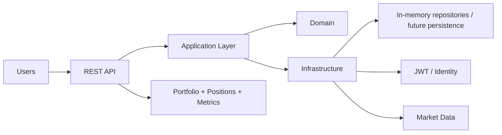

# PortfolioAnalytics API


PortfolioAnalytics API is a financial analytics and portfolio management backend designed to be useful from the first iteration. The project combines authentication, portfolio tracking, position management, and market data access in a REST API that can serve as the foundation for backtesting, financial metrics, and decision automation.

## Architecture



The solution is organized into layers:

- `PortfolioAnalytics.Domain`: entities, business rules, and domain validation.
- `PortfolioAnalytics.Application`: handlers, commands, queries, DTOs, and use-case orchestration.
- `PortfolioAnalytics.Infrastructure`: repositories, authentication, hashing, and supporting infrastructure.
- `PortfolioAnalytics.Api`: HTTP controllers, dependency wiring, and API surface.
- `tests`: validation of core business rules and MVP flows.

## What problem does it solve?

Most financial workflows begin as local scripts with fragmented logic and poor traceability. This project centralizes the core of financial domain logic in a small but credible API, using clear rules and a structure that can evolve without losing maintainability.

## What it does

- Registers and identifies users.
- Issues and validates JWT tokens to protect access.
- Creates and manages investment portfolios.
- Adds positions by symbol and asset type.
- Syncs historical market series.
- Exposes HTTP endpoints for frontend and integration consumers.
- Provides a foundation for backtesting and metric calculation.

## Engineering considerations

### Domain integrity

The core rules live in the domain layer. For example, duplicate symbols within the same portfolio are rejected, and market data points validate their structure before they are persisted. This helps prevent high-impact business errors.

### Simple and secure authentication

The API uses JWT to protect user and portfolio endpoints. The goal is to keep authentication straightforward, useful for an MVP, and easy to replace later with a more durable persistence-backed solution.

### Clean architecture

Responsibilities are separated to keep the project understandable:

- the API does not own business logic,
- the domain does not know about HTTP or EF Core,
- infrastructure encapsulates the concrete implementation details.

This reduces coupling and makes it easier to test each layer.

## Technology stack

- C# / .NET 8
- ASP.NET Core Web API
- xUnit for tests
- JWT for authentication
- BCrypt for password hashing
- Repository Pattern (Abstracted for upcoming PostgreSQL/EF Core integration, currently in-memory for MVP)
- Docker for local environment and deployment support

## How to use it

1. Clone the repository:

```bash
git clone https://github.com/your-user/PortfolioAnalytics.git
cd PortfolioAnalytics
```

2. Restore dependencies:

```bash
dotnet restore
```

3. Start the local PostgreSQL environment (optional while the API uses in-memory repositories):

Copy `.env.example` to `.env` and adjust the values if needed, then run:

```powershell
docker compose up -d
docker compose ps
```

The database is exposed on `localhost:5432` by default. The container includes a healthcheck and stores its data in the `portfolioanalytics-postgres-data` Docker volume.

To stop the database without deleting its data:

```powershell
docker compose down
```

To stop it and remove the local database volume:

```powershell
docker compose down -v
```

PostgreSQL does not need to be installed or running on the host. Docker Desktop and a free local port are enough. `.env` is local configuration and must not be committed.

4. Configure JWT (optional for local development):

The API has a development-only fallback key, but deployments should provide a unique secret through configuration:

```powershell
$env:Jwt__Key = "replace-with-a-long-random-secret"
$env:Jwt__Issuer = "PortfolioAnalytics"
$env:Jwt__Audience = "PortfolioAnalyticsUsers"
```

5. Run the API:

```bash
dotnet run --project src/PortfolioAnalytics.Api
```

6. The API is available locally at:

```text
https://localhost:5001
http://localhost:5000
```

7. Verify the service and use JWT on protected endpoints:

```text
GET /health
POST /api/auth/register
POST /api/auth/login
```

The complete request sequence is: register, login, create a portfolio, add a position, query seeded market data, queue a backtest, poll its result until it is completed, and retrieve its metrics. The backtest endpoint returns `202 Accepted` with a result location while the in-memory background worker processes it. Swagger is available in development at `/swagger`.

### Persistence and demo data

The current MVP intentionally uses in-memory repositories and an in-memory backtest execution store. This keeps local setup fast and makes the workflow deterministic; users, portfolios, market data, and backtest results are reset whenever the API restarts. PostgreSQL with EF Core is the next durable-persistence milestone, not a hidden production dependency.

Protected portfolio operations are scoped to the authenticated user. A portfolio that belongs to another user is treated as not found, avoiding resource enumeration through the API.

On startup, the API loads a fixed sample series for `AAPL`, `MSFT`, and `SPY` covering 2024-01-02 through 2024-01-04. This allows the market-data and backtest flows to be reproduced without an external provider.

## MVP flow

### 1. Registration and authentication
- A user signs up with an email, full name, and password.
- The password is hashed before storage.
- The system emits a JWT for future access.

### 2. Portfolio and positions
- The user creates a portfolio.
- Adds positions by symbol, quantity, and price.
- The system rejects duplicate symbols at the portfolio level.

### 3. Market data
- Market data points are loaded with date, opening price, high, low, close, and volume.
- The data supports later analysis and metric calculations.

## Roadmap

The project roadmap lives in [ToDo.md](./ToDo.md).

### Phase 1: Functional MVP
- JWT authentication
- portfolio and position management
- market data synchronization
- domain rule validation
- unit tests for critical flows

### Phase 2: Financial analytics
- base backtesting engine
- calculation of metrics such as return, drawdown, and Sharpe
- strategy comparison
- real persistent storage

### Phase 3: Maturity
- PostgreSQL + EF Core
- real market data provider integrations
- integration tests
- observability and deployment readiness

## Current status

The project already has a useful functional base for an MVP:

- users with JWT authentication,
- portfolio and position management,
- protected API access,
- in-memory market data support,
- unit tests for the most valuable rules.

It is not a final production platform yet, but it is a real, solid foundation for continued development.

## Contributing

Contributions are prioritized by functional value and technical clarity. The goal is to keep the project honest and incremental, without adding unnecessary layers or theoretical overengineering.

## Notes

This project is designed as a useful foundation for financial analysis and investment strategy, not as a disconnected architecture demo. The focus is on pragmatic, Domain-Driven Design (DDD) over theoretical over-engineering.
