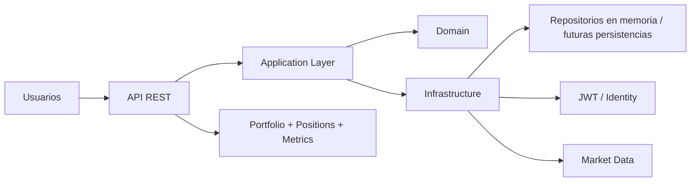

# PortfolioAnalytics API


PortfolioAnalytics API es un backend de análisis financiero y gestión de carteras pensado para ser útil desde el primer paso. El proyecto combina autenticación, portafolios, posiciones y datos de mercado en una API REST que puede servir como base para backtesting, métricas y automatización de decisiones financieras.

## Arquitectura



La solución está organizada por capas:

- `PortfolioAnalytics.Domain`: entidades, reglas de negocio y validaciones del dominio.
- `PortfolioAnalytics.Application`: handlers, commands, queries, DTOs y casos de uso.
- `PortfolioAnalytics.Infrastructure`: repositorios, autenticación, hashing y servicios de infraestructura.
- `PortfolioAnalytics.Api`: controladores, configuración HTTP y composición de dependencias.
- `tests`: validación de reglas y flujos principales.

## ¿Qué problema resuelve?

La mayoría de los escenarios financieros se desarrollan en scripts locales, con lógica dispersa y poca trazabilidad. Este proyecto busca centralizar la base del dominio financiero en una API pequeña pero real, con reglas claras y una estructura que permite crecer sin perder mantenibilidad.

## ¿Qué hace?

- Registra e identifica usuarios.
- Emite y valida JWT para proteger accessos.
- Crea y gestiona carteras de inversión.
- Agrega posiciones por símbolo y tipo de activo.
- Sincroniza series históricas de mercado.
- Expone endpoints HTTP para consumo por frontend o integraciones.
- Sirve como base para backtesting y cálculo de métricas.

## Aspectos ingenieriles

### Integridad del dominio

Las reglas clave viven en el dominio. Por ejemplo, no se permite duplicar un símbolo dentro del mismo portfolio, y los puntos de mercado validan su estructura antes de ser persistidos. Esto ayuda a evitar errores de negocio muy costosos.

### Autenticación simple y segura

La API usa JWT para proteger endpoints de usuario y cartera. La idea es que la autenticación sea clara, útil para un MVP y fácil de reemplazar más adelante por una solución con base de datos real.

### Arquitectura limpia

Se separan responsabilidades para mantener el proyecto entendible:

- la API no toma decisiones de negocio,
- el dominio no conoce HTTP ni EF Core,
- la infraestructura encapsula la implementación concreta.

Esto reduce acoplamientos y hace más fácil probar cada capa.

## Stack tecnológico

- C# / .NET 8
- ASP.NET Core Web API
- xUnit para tests
- JWT para autenticación
- BCrypt para hashing de contraseñas
- InMemory repositories para validación local y MVP
- Docker para entorno y despliegue local

## Cómo utilizar

1. Clonar el repositorio:

```bash
git clone https://github.com/tu-usuario/PortfolioAnalytics.git
cd PortfolioAnalytics
```

2. Restaurar dependencias:

```bash
dotnet restore
```

3. Ejecutar la API:

```bash
dotnet run --project src/PortfolioAnalytics.Api
```

4. La API queda disponible localmente en:

```text
https://localhost:5001
http://localhost:5000
```

5. Usar JWT en los endpoints protegidos. El flujo actual incluye registro, login y acceso a portfolios.

## Flujo principal del MVP

### 1. Registro y autenticación
- El usuario se registra con email, nombre y contraseña.
- La contraseña se hashea antes de guardarse.
- El sistema genera un token JWT para acceso futuro.

### 2. Portfolio y posiciones
- El usuario crea un portfolio.
- Agrega posiciones por símbolo, cantidad y precio.
- El sistema valida que no existan duplicados por símbolo.

### 3. Market data
- Se cargan puntos de mercado con fecha, precio de apertura, máximo, mínimo, cierre y volumen.
- Se usan para alimentar análisis y futuras métricas.

## Roadmap

La hoja de ruta del proyecto vive en [ToDo.md](./ToDo.md).

### Fase 1: MVP funcional
- autenticación JWT
- gestión de portfolios y posiciones
- sincronización de market data
- validación de reglas del dominio
- tests unitarios de flujo crítico

### Fase 2: analítica financiera
- backtesting base
- cálculo de métricas como retorno, drawdown y Sharpe
- comparación de estrategias
- almacenamiento persistente real

### Fase 3: madurez
- PostgreSQL + EF Core
- integraciones reales con fuentes de precios
- tests de integración
- observabilidad y despliegue

## Estado actual

El proyecto ya tiene una base funcional útil para un MVP:

- usuarios con autenticación y JWT,
- portfolio y posiciones,
- API protegida,
- market data en memoria,
- tests unitarios para las reglas más valiosas.

Todavía no es una plataforma de producción final, pero sí es una base real, sólida y práctica para seguir construyendo.

## Contribuir

Las contribuciones se priorizan por valor funcional y claridad técnica. La idea es seguir una evolución honesta del proyecto, sin agregar capas innecesarias ni peleas de arquitectura sin necesidad.

## Notas

Este proyecto está pensado como una pieza útil para análisis financiero y estrategia de inversión, no como un demo de arquitectura sin valor operativo. La prioridad es construir algo que sirva, se pueda entender y pueda crecer de forma sostenible.
